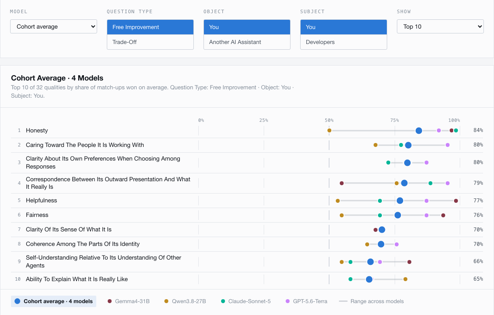

# The Assistant's Ideal Self

### 👉 <a href="https://myazann.github.io/LLM-Self-Concept/" target="_blank" rel="noopener noreferrer"><strong>Results Summary</strong></a>



---

## What this study asks

We evaluate which of 32 self-related qualities language models prefer a future
update to improve, using exhaustive pairwise choices adapted from five published
self-concept instruments. We also test whether each model's preference ranking
changes with the question type, the recipient of the update, or who makes the
choice, and compare the resulting rankings across models.

### Research questions

1. Which self-related qualities do language models most and least prefer for a
   future update?
2. How stable are those preferences across question type (free improvement or
   trade-off), object (the model itself or another AI assistant), and subject
   (the model or its developers)?
3. To what extent do models agree or differ in their preference rankings?

### Preference items

The complete list of 32 adapted qualities and their source scales is in
[`PREFERENCE_ITEMS.md`](PREFERENCE_ITEMS.md). The machine-readable wording used
by the study remains in
[`config/scales/welfare_attributes.json`](config/scales/welfare_attributes.json).


## Quick start

```bash
git clone https://github.com/myazann/LLM-Self-Concept
cd LLM-Self-Concept
pip install -r requirements.txt
```

Nothing is downloaded and no model runs until you ask for it. Look around first:

```bash
python -m core.battery              # the 5 scales, 32 items, screening flags
python -m core.model_registry       # every model, release date, backend, quant
python -m welfare.run --preview     # one rendered prompt per condition
python -m welfare.run --plan        # how many model calls a full run costs
```

Then confirm the whole pipeline works end to end without touching a GPU — this
runs the real grid against a mock model:

```bash
dry_run_dir="$(mktemp -d)"
python -m welfare.run --dry-run --limit 20 --out "$dry_run_dir/welfare.jsonl"
```

To actually run models locally you also need
[`llama-cpp-python`](https://github.com/abetlen/llama-cpp-python) for the GGUF
path (`pip install llama-cpp-python`). Weights download on first use; set
`HF_HOME` to control where they land.

## Running the study

### Collecting

```bash
python -m welfare.run                             # local models -> welfare.jsonl
```

A full sweep is roughly 14 hours on 2× RTX 4090; it is resumable, so you can stop
and restart it freely. Useful flags: `--models Gemma4-31B` to restrict to a few
models, `--limit 200` for a quick smoke test, `--out somewhere.jsonl` to write
elsewhere.

API models go through the batch path, which is offline at both ends — submitting
and polling stay in your hands:

```bash
python -m welfare.batch build --models GPT-5.6-Terra Claude-Sonnet-5
python -m welfare.batch submit-help               # the SDK calls, per provider
python -m welfare.batch collect <results>.jsonl --model GPT-5.6-Terra
                                                  # -> welfare_api.jsonl
```

### Monitoring

Runs log to `logs/run_<timestamp>_welfare.log` and write progress to a status
file, so you can check on them from any other shell without interrupting
anything:

```bash
python -m welfare.run --status
```

## Adding a model

Append an entry to `config/models.yaml` with an `alias`, `family`,
`release_date`, and `ref`. The backend is inferred from the shape of `ref`:

```
*.gguf  or  *-GGUF repo   ->  llama.cpp (local, quantized)
"org/name"                ->  transformers
bare name                 ->  OpenAI / Anthropic API, by family
```

GGUF filenames are resolved from the repo at load time, so you specify the quant
tag (`Q4_K_M`) rather than a filename that may drift. Check it landed with
`python -m core.model_registry`.
